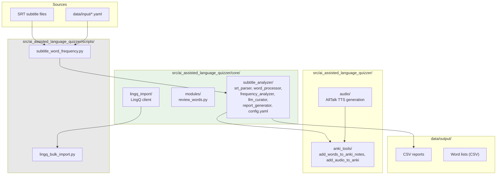

# ai_assisted_language_quizzer -- Architecture

<!-- Purpose: High-level module map for contributors.
     Keep this SHORT. Only document things unlikely to change frequently.
     Revisit a couple times per year, not with every commit.
     Ref: matklad architecture essay, architecture.md standard. -->

## Overview

Language learning tool that processes SRT subtitle files into vocabulary lists and flashcards. The core pipeline is: SRT parsing -> word processing -> stopword filtering -> frequency analysis -> lemmatization -> LLM curation -> report generation -> Anki export + TTS. The package lives under `src/ai_assisted_language_quizzer/`.

Configuration flows through `src/ai_assisted_language_quizzer/core/subtitle_analyzer/config.yaml` (tunable params) and `.env` (secrets). Scripts load YAML with a `_get_default_config()` fallback; CLI flags override config which overrides defaults.

## Codemap

### src/ai_assisted_language_quizzer/core/subtitle_analyzer/

Library classes for subtitle analysis. `srt_parser.py` reads SRT files into structured data. `word_processor.py` tokenizes and normalizes text. `stopword_manager.py` filters common words. `frequency_analyzer.py` counts term frequency. `lemma_grouper.py` groups by lemma via spaCy. `llm_curator.py` sends words to DeepL/Minimax for translation/curation. `report_generator.py` produces CSV output. `config.yaml` holds all tunable params.

### src/ai_assisted_language_quizzer/scripts/

CLI entry points using argparse. `subtitle_word_frequency.py` is the main analysis pipeline -- wires subtitle_analyzer classes into a runnable script. `lingq_bulk_import.py` calls the LingQ API client. `translate_wordlist.py` translates word lists via DeepL.

### src/ai_assisted_language_quizzer/core/lingq_import/

LingQ API client. Handles authentication and bulk import of vocabulary lists to LingQ platform.

### src/ai_assisted_language_quizzer/anki_tools/

Anki deck manipulation scripts. `add_words_to_anki_notes.py` creates flashcard notes with word, frequency, translation. `add_audio_to_anki.py` attaches TTS audio to existing notes.

### src/ai_assisted_language_quizzer/audio/

TTS generation via AllTalk. `download_from_alltalk.py` fetches audio for word lists.

## Architectural Invariants

- All application code lives under `src/ai_assisted_language_quizzer/` -- no code at repo root
- Config params go in `src/ai_assisted_language_quizzer/core/subtitle_analyzer/config.yaml` -- never hardcode tunables
- API keys go in `.env` -- never commit secrets
- Imports always at top of file -- never inside function bodies
- `requirements.txt` at repo root is the single source of truth for dependencies
- spaCy lemmatization is the only external NLP dependency

## Layer Boundaries

- **CLI / Library boundary:** Scripts (`src/ai_assisted_language_quizzer/scripts/`) are entry points that instantiate core classes; they do not implement analysis logic themselves
- **Config / Code boundary:** Config values flow from YAML into class constructors; scripts never hardcode tunable values
- **External API boundary:** DeepL and LingQ are called through dedicated client modules in `lingq_import/` -- no raw API calls in pipeline scripts
- **Output boundary:** All generated files go to `data/output/` -- scripts never write outside this directory

## Cross-Cutting Concerns

- **Error handling:** Scripts catch exceptions, log errors, and continue processing where possible
- **Configuration:** YAML config with `_get_default_config()` fallback; CLI flags override config
- **Logging:** stdlib logging; scripts output numbered progress steps
- **Testing:** No pytest suite. Manual validation with --help and small input files.

<!-- Guidelines:
     - Keep the whole file under 150 lines
     - Name entities, do not link them
     - If a section does not apply, remove it rather than leaving it empty
     - Update this file when module boundaries change, not for every code change
-->