# AI Assisted Language Quizzer - Code Flow Documentation

This document provides comprehensive code flow diagrams using Mermaid -->help you understand how the project works. Each section covers a major workflow with detailed steps.

---

## Table of Contents

1. [Subtitle Word Frequency Analysis Pipeline](#1-subtitle-word-frequency-analysis-pipeline)
2. [Translation Workflow](#2-translation-workflow)
3. [Anki Integration Flows](#3-anki-integration-flows)
4. [Audio Generation Flow](#4-audio-generation-flow)
5. [Complete Data Flow Summary](#5-complete-data-flow-summary)
6. [Key Classes and Responsibilities](#6-key-classes-and-responsibilities)
7. [Configuration & Environment](#7-configuration--environment)
8. [Common Workflows](#8-common-workflows)
9. [Error Handling Summary](#9-error-handling-summary)
This is the core workflow that extracts vocabulary from subtitle files.

### 1.1 Main Entry Point Flow

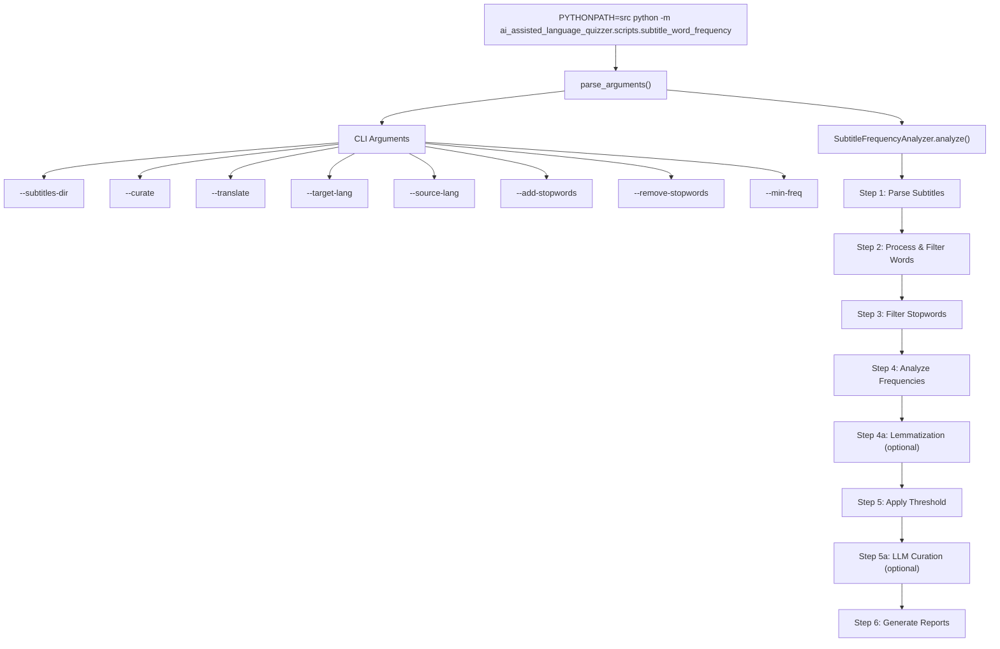

### 1.2 Analysis Pipeline Steps

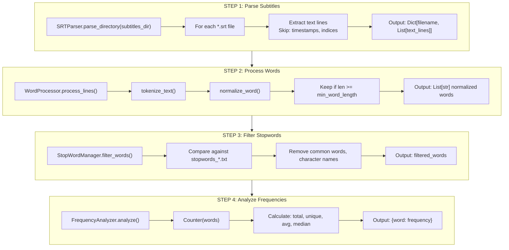

### 1.3 Lemmatization (Optional)

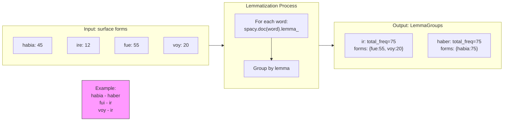

### 1.4 LLM Curation (Optional --curate flag)

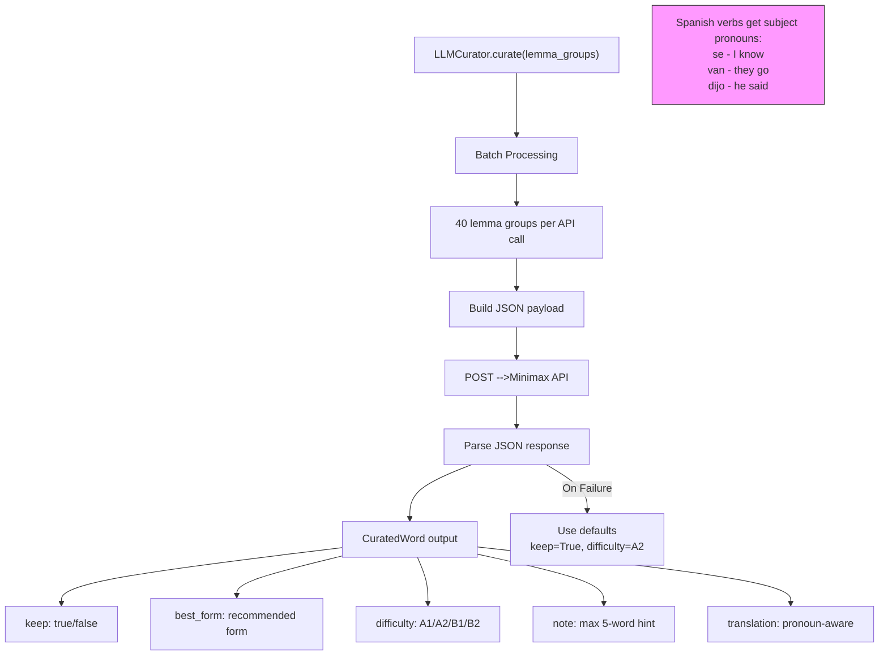

### 1.5 Complete Analysis Pipeline (Detailed)

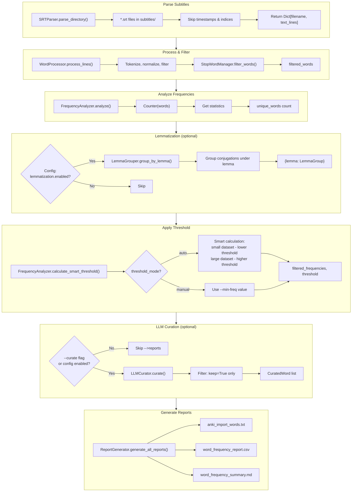

---

## 2. Translation Workflow

### 2.1 DeepL Translation Flow

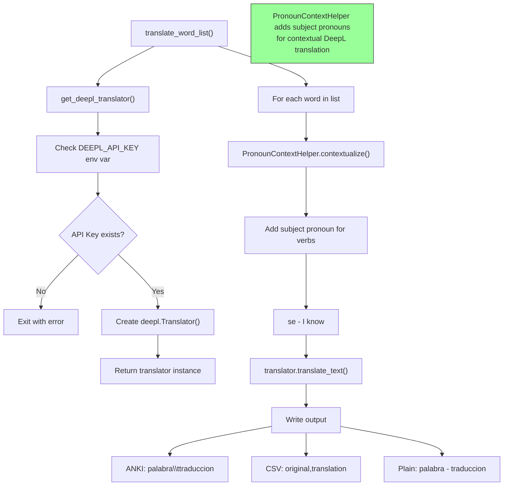

### 2.2 Integrated vs Standalone Translation

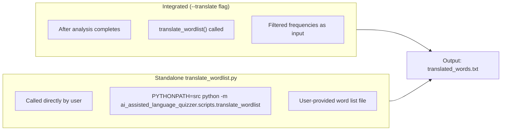

---

## 3. Anki Integration Flows

### 3.1 Add Audio -->Anki Notes

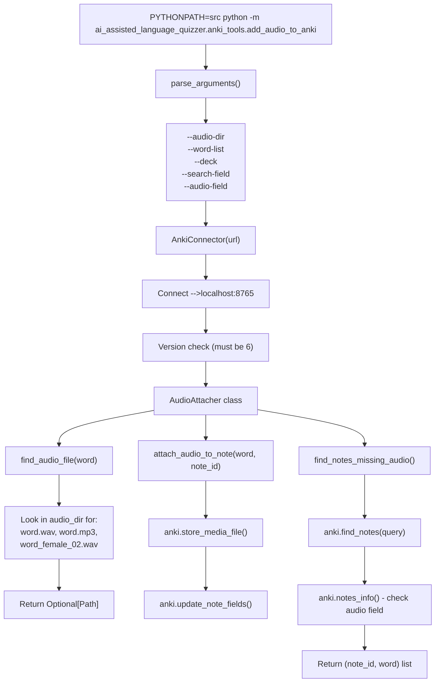

### 3.2 Add Words -->Anki Notes

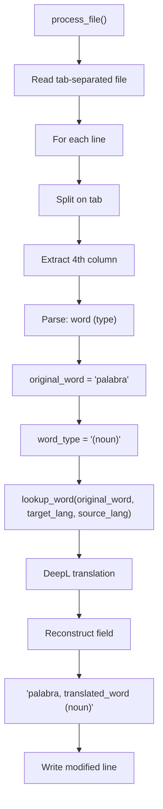

### 3.3 AnkiConnect API Operations

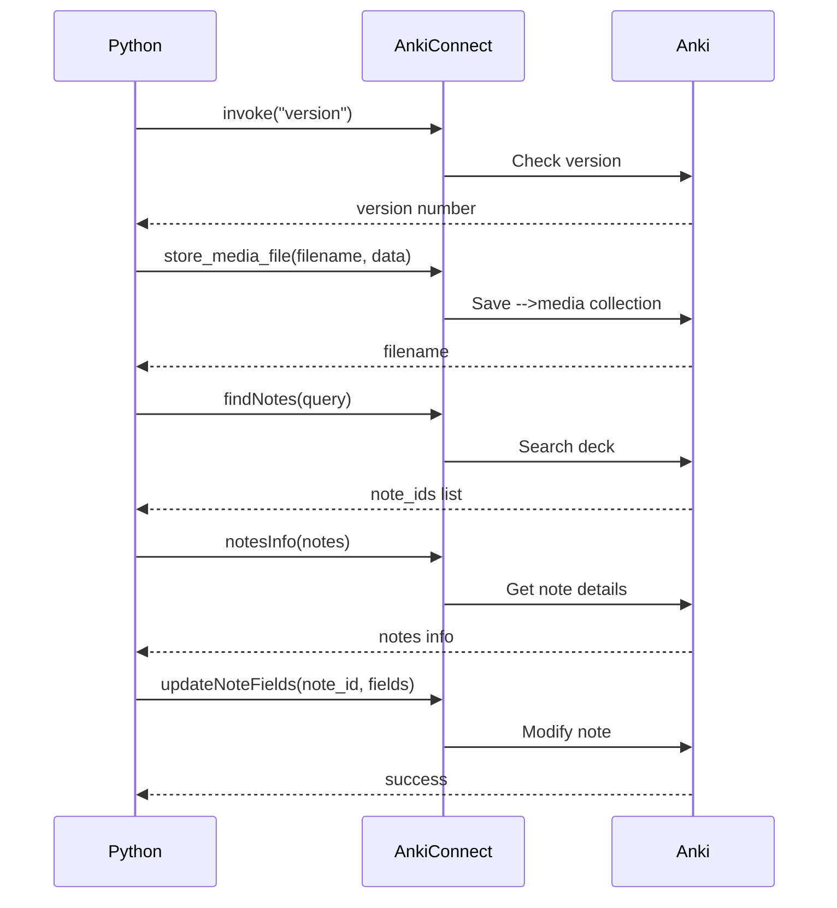

---

## 4. Audio Generation Flow

### 4.1 Main Audio Generation Flow

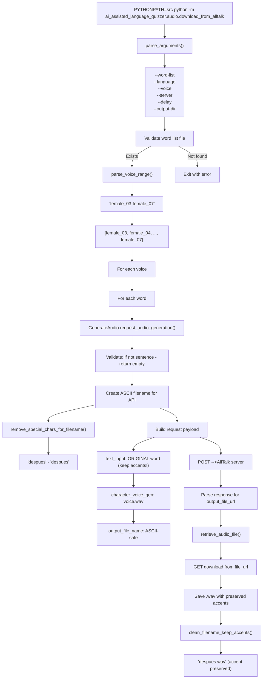

### 4.2 Filename Handling Detail

```mermaid
flowchart TD
    A["Two different filename functions for different purposes"]
    
    B["For AllTalk API"] -->B1["remove_special_chars_for_filename()"]
    B1 -->B2["Requires ASCII-only output_file_name"]
    B2 -->B3["Removes: accents, special chars, spaces"]
    B3 -->B4["Example: 'despues' - 'despues'"]
    
    C["For final filename"] -->C1["clean_filename_keep_accents()"]
    C1 -->C2["Human-readable filenames"]
    C2 -->C3["Removes: / \\ : * ? \" < > |"]
    C3 -->C4["Keeps: a, e, i, o, u"]
    C4 -->C4b["Example: 'despues.wav'"]
    
    note4["IMPORTANT: Original word with accents is sent to TTS for proper pronunciation. Only the filename is ASCII-fied."]:::note
    
```

---

## 5. Complete Data Flow Summary

```mermaid
flowchart LR
    subgraph Input ["Input"]
        S["subtitles/*.srt"]
    end
    
    subgraph Core ["subtitle_word_frequency.py"]
        A["SubtitleFrequencyAnalyzer.analyze()"]
        
        A --> A1["SRTParser"]
        A --> A2["WordProcessor"]
        A --> A3["StopWordManager"]
        A --> A4["FrequencyAnalyzer"]
        A --> A5["LemmaGrouper (optional)"]
        A --> A6["LLMCurator (optional)"]
        A --> A7["ReportGenerator"]
    end
    
    subgraph Output ["data/output/"]
        O1["anki_import_words.txt"]
        O2["word_frequency_report.csv"]
        O3["word_frequency_summary.md"]
    end
    
    subgraph Translate ["translate_wordlist.py"]
        T["DeepL Translation"]
        T --> T1["translated_words.txt"]
    end
    
    subgraph Audio ["download_from_alltalk.py"]
        AU["AllTalk TTS API"]
        AU --> AU1["audio/*.wav"]
    end
    
    subgraph Anki ["anki_tools/"]
        AN["AnkiConnect API"]
        AN --> AN1["Cards with audio"]
    end
    
    Input --> Core
    Core --> Output
    Output --> T
    Output --> AU
    T1 --> AN
    AU1 --> AN
```

---

## 6. Key Classes and Responsibilities

```mermaid
flowchart TB
    subgraph subtitle_analyzer ["subtitle_analyzer/"]
        SA1["SRTParser<br/>Parse .srt files"]
        SA2["WordProcessor<br/>Tokenize, normalize"]
        SA3["StopWordManager<br/>Load, filter stopwords"]
        SA4["FrequencyAnalyzer<br/>Count frequencies"]
        SA5["LemmaGrouper<br/>Group conjugations (spaCy)"]
        SA6["LLMCurator<br/>Score via Minimax API"]
        SA7["ReportGenerator<br/>Generate CSV, TXT, MD"]
        SA8["translator<br/>DeepL functions"]
    end
    
    subgraph anki_tools ["anki_tools/"]
        AN1["AnkiConnector<br/>Connect -->AnkiConnect API"]
        AN2["AudioAttacher<br/>Attach audio files"]
    end
    
    subgraph audio ["audio/"]
        AU1["GenerateAudio<br/>AllTalk TTS API"]
    end
    
    ```

---

## 7. Configuration & Environment

```mermaid
flowchart TD
    subgraph Environment ["Environment Variables (.env)"]
        E1["DEEPL_API_KEY"]
        E2["MINIMAX_API_KEY (optional)"]
        E3["ALLTALK_URL (optional)"]
    end
    
    subgraph Config ["config.yaml"]
        C1["lemmatization.enabled: false"]
        C1 --> C1a["language_model: es_core_news_sm"]
        
        C2["llm_curation.enabled: false"]
        C2 --> C2a["model: minimax-m2.5"]
        C2 --> C2b["batch_size: 40"]
        C2 --> C2c["learner_level: A2-B1"]
        
        C3["translation.enabled: false"]
        C3 --> C3a["source_lang: ES"]
        C3 --> C3b["target_lang: EN-US"]
        
        C4["paths"]
        C4 --> C4a["subtitles_directory: ../subtitles"]
        C4 --> C4b["output_directory: ../../data/output"]
        
        C5["analysis"]
        C5 --> C5a["target_words: 500"]
        C5 --> C5b["min_word_length: 2"]
        C5 --> C5c["threshold_mode: auto"]
    end
```

---

## 8. Common Workflows

### 8.1 Complete Workflow (Recommended)

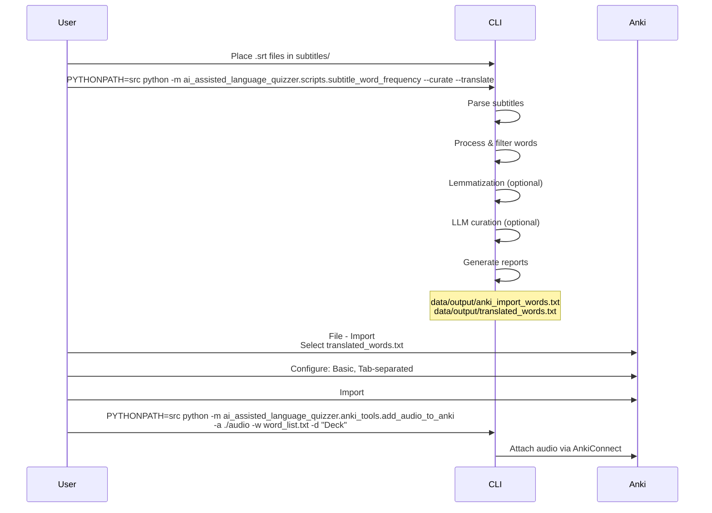

### 8.2 Step-by-Step Workflow

```mermaid
flowchart LR
    A["1. Extract vocabulary<br/>PYTHONPATH=src python -m ai_assisted_language_quizzer.scripts.subtitle_word_frequency"] --> B["2. Translate<br/>PYTHONPATH=src python -m ai_assisted_language_quizzer.scripts.translate_wordlist"]
    B --> C["3. Generate audio (optional)<br/>PYTHONPATH=src python -m ai_assisted_language_quizzer.audio.download_from_alltalk"]
    C --> D["4. Import -->Anki manually"]
    D --> E["5. Attach audio (optional)<br/>PYTHONPATH=src python -m ai_assisted_language_quizzer.anki_tools.add_audio_to_anki"]
```

---

## 9. Error Handling Summary

```mermaid
flowchart TD
    subgraph SRTParser ["SRTParser"]
        S1["Logs errors, continues with other files"]
        S2["Raises: FileNotFoundError, UnicodeDecodeError"]
    end
    
    subgraph WordProcessor ["WordProcessor"]
        W1["No explicit error handling"]
        W2["Relies on regex and length filtering"]
    end
    
    subgraph FrequencyAnalyzer ["FrequencyAnalyzer"]
        F1["Returns empty if no words analyzed"]
        F2["calculate_smart_threshold handles 0 unique words"]
    end
    
    subgraph LLMCurator ["LLMCurator"]
        L1["On API failure: uses defaults (keep=True, A2)"]
        L2["Retries once, then fails gracefully"]
    end
    
    subgraph AnkiConnector ["AnkiConnector"]
        A1["Raises exceptions on connection failures"]
        A2["Version check ensures compatibility"]
    end
    
    subgraph AudioAttacher ["AudioAttacher"]
        AU1["Silently skips missing audio files"]
        AU2["Reports count of successful attachments"]
    end
    
    subgraph DeepL ["DeepL Translation"]
        D1["On error: marks word as '[ERROR]'"]
        D2["Continues processing remaining words"]
    end
```

---

*For more details on any specific component, refer -->the inline documentation in each module or run any script with `--help` for usage information.*